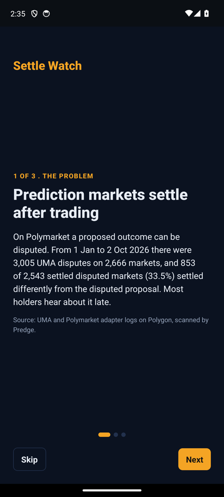
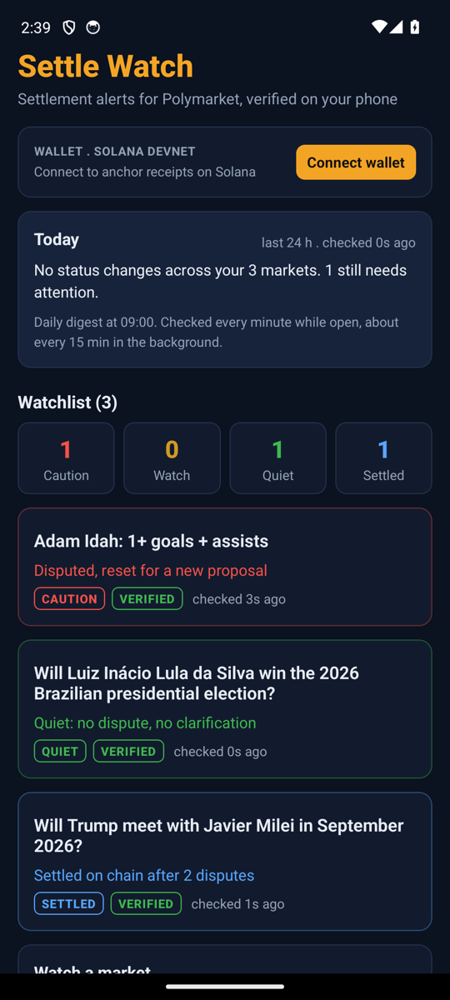
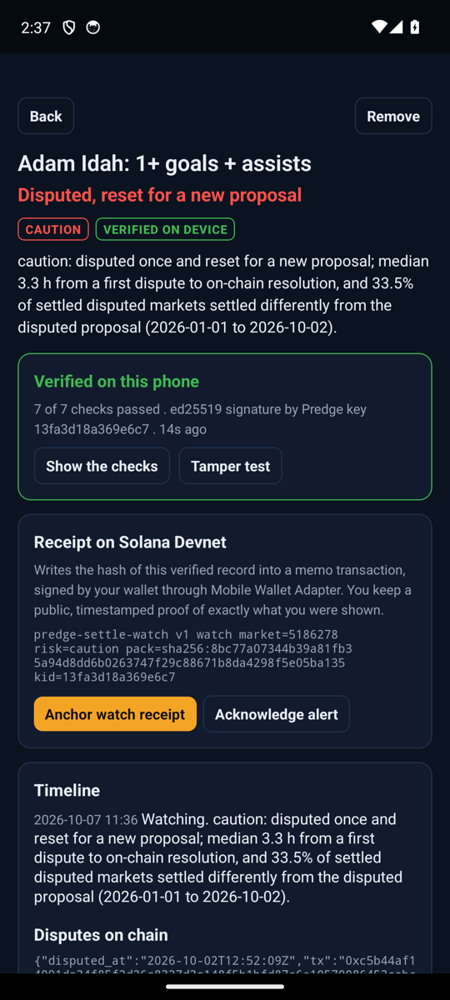
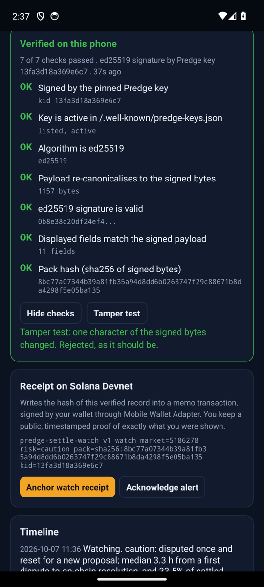
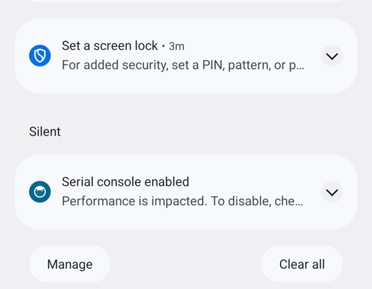

# Settle Watch

**Settlement alerts for prediction markets, verified on your phone.**

Settle Watch is a native Android app (React Native, Solana Mobile Stack). You keep a watchlist of Polymarket markets. When one gets a UMA dispute, a clarification, a UMA token-holder vote or settles on chain, your phone alerts you. Every record is signed by Predge with ed25519 and the phone verifies the signature itself before showing it. You can then anchor a receipt of exactly what you saw on Solana, signed through Mobile Wallet Adapter.

Built for **Clock In, the Solana Mobile hackathon** (Radiants, 2026). New project, started in October 2026 in this repository.

| | |
|---|---|
| Download | [Latest APK (GitHub Releases)](https://github.com/predgeAI/predge-settle-watch/releases/latest) |
| Version | 0.2.0 (versionCode 2), Android 7+, arm64 |
| Solana | Mobile Wallet Adapter, memo receipts on devnet (default) or mainnet |
| License | MIT |

| Onboarding | Today and watchlist | Verified on this phone | Checks and tamper test |
|---|---|---|---|
|  |  |  |  |

Daily digest notification:



Screenshots: Android 14 emulator, build 0.2.0. Wallet connection and the Solana receipt need a real wallet app, so they are shown in the demo video recorded on a phone.
<!-- PHONE SCREENSHOTS: add docs/screenshots/v0.2/07-connect.png and 08-receipt-explorer.png from a real device -->

## The problem

Prediction markets settle after trading. On Polymarket the outcome goes through UMA's optimistic oracle, where a proposed answer can be disputed. Predge indexed every UMA Optimistic Oracle and Polymarket adapter event on Polygon from 1 January to 2 October 2026:

- **3,005 UMA disputes on 2,666 Polymarket markets.**
- **323 markets were disputed twice or more**, which sends the outcome to a UMA token-holder vote.
- **Of 2,543 settled disputed markets, 853 (33.5%) settled differently from the disputed proposal.**
- **Median time from first dispute to on-chain resolution: 3.3 h. After a second dispute: 88.5 h.**

A dispute is time-critical, it happens around the clock, and holders usually hear about it late, from social media, with no way to check what actually happened.

## Why it matters to Solana users

Jupiter's Prediction API aggregates liquidity from Polymarket and Kalshi, with Polymarket as the default provider ([Jupiter developer guide](https://developers.jup.ag/docs/guides/how-to-build-a-prediction-market-app-on-solana), [Jupiter Predict docs](https://docs.jup.ag/user-docs/trade/predict)). Solana users who trade prediction markets on their phone can therefore hold positions in Polymarket-sourced markets, and how those markets resolve is exactly what Settle Watch tracks.

## How the app addresses the judging criteria

### Stickiness and product-market fit
- **A daily reason to open the app.** The *Today* card at the top lists every watched market whose status changed in the last 24 hours (new dispute, clarification, UMA vote, pause, on-chain settlement), and how many still need attention.
- **Daily digest notification.** Once a day, after the hour you choose, one notification summarises your watchlist: what changed and how many markets are still in Caution or Watch. It runs from the background task, so it arrives even if you do not open the app.
- **Real-time alerts.** The watchlist is checked every 60 s while open and about every 15 min in the background (Android WorkManager, survives reboot). Tapping an alert opens that market.
- **A watchlist that grows with your positions.** Up to 50 markets, added by Polymarket link, slug, numeric id or condition id.
- Honest status: no users, downloads or revenue yet. Revenue is $0.

### User experience
- **Three-screen onboarding** explains the problem and what the app does, then starts you with three real markets in one tap (one disputed and not settled yet, one disputed twice and settled, one quiet).
- **Watchlist at a glance:** counts by status (Caution, Watch, Quiet, Settled) that double as filters, colour-tinted rows and one plain-language status line per market, for example "Disputed, reset for a new proposal" or "Settled on chain after 2 disputes".
- **Verification without hash overload:** one green "Verified on this phone" banner with "7 of 7 checks passed". The individual checks and hashes are one tap away.
- Native Android notifications on a high-importance channel, pull to refresh, paste from clipboard, confirmation before removing a market or sending a mainnet transaction.
- Dark navy and amber design matching predge.io.

### Innovation
- **Verification on the phone, not trust in a server.** Each record carries an ed25519 attestation. The phone checks the pinned key, that the key is active in `/.well-known/predge-keys.json`, the algorithm, that the payload re-canonicalises to the signed bytes, the signature, and that every value on screen equals the signed one. A *Tamper test* changes one character and shows verification fail.
- **A receipt you own, on Solana.** "Anchor watch receipt" writes the sha256 of the exact verified record into a Solana memo transaction, signed through Mobile Wallet Adapter (Seed Vault on Seeker). You hold a public, timestamped proof of what you were shown and when you acted on it.
- Solana keys are ed25519 too, so the signed data, the signature checks and the wallet share one kind of cryptography on the device.
- We found no other mobile app that tracks prediction-market settlement disputes.

### Presentation and demo
- Demo video (about 3 minutes, recorded on a phone): link in the submission form.
- Pitch deck (PDF): link in the submission form.
- Reproduce the claims yourself: `npm test` (offline checks) and `npx tsx scripts/verify-live.ts 5186278 4585694 601819` (verifies live signed records with the app's own verifier).

## Why mobile, why Solana Mobile

- Disputes and clarifications are time-critical and happen at any hour. The phone is where an alert reaches you.
- The phone has the wallet. Mobile Wallet Adapter turns "I saw this" into a signed on-chain receipt in one tap, with the key in Seed Vault on Seeker.
- Everything sensitive runs locally: signature checks, the watchlist and the wallet session never leave the device.

## Install and try it (5 minutes)

1. Download the APK from [Releases](https://github.com/predgeAI/predge-settle-watch/releases/latest) and install it on a Seeker or any arm64 Android phone (allow installs from your browser, or `adb install`).
2. Install a Mobile Wallet Adapter wallet (Phantom, Solflare, or Seed Vault on Seeker) and set it to **devnet**.
3. Open Settle Watch, go through the three intro screens and tap **Add 3 example markets**. Allow notifications.
4. Tap **Connect wallet** and approve. Tap **Devnet SOL** if the balance is zero (falls back to faucet.solana.com).
5. Open "Adam Idah: 1+ goals + assists" (disputed, not settled): see the status line and **Verified on this phone**. Tap **Show the checks**, then **Tamper test**.
6. Tap **Anchor watch receipt**, approve in the wallet, then **Open explorer** to see the memo with the record hash.
7. In Settings, **Digest now** shows the daily digest for your real watchlist. **Send test alert** shows a notification marked [TEST], which is never a real dispute.
8. Optional: switch **Receipt network** to Mainnet. The app asks for confirmation; the cost is the network fee only (about 0.000005 SOL).

## Architecture

```
 Polygon (UMA Optimistic Oracle, Polymarket UMA CTF adapter)
        |  read live by
        v
 Predge API (existing service)  GET /v1/settlement-risk/:market
        |  JSON record + ed25519 attestation (key 13fa3d18a369e6c7)
        v
 Settle Watch (Android)
   src/api.ts       input validation, shape-checked API client
   src/verify.ts    7 on-device checks (tweetnacl ed25519, sha256, canonical JSON)
   src/watcher.ts   60 s foreground poll, background task, change detection,
                    alerts, daily digest
   src/store.ts     AsyncStorage watchlist, settings, wallet session, Today logic
   src/wallet.ts    Mobile Wallet Adapter (authorize, reauthorize, deauthorize,
                    signAndSendTransactions), memo receipt, confirmation over RPC
   App.tsx          onboarding, Today, watchlist, detail, settings
        |  memo: "predge-settle-watch v1 watch market=<id> risk=<level>
        |         pack=sha256:<hash> kid=13fa3d18a369e6c7"
        v
 Solana (devnet by default, mainnet optional), Memo program
```

The Predge data API existed before the hackathon and is used as a backend dependency:

- `GET https://api.predge.io/v1/settlement-risk/:market` (free, signed ed25519)
- `GET https://api.predge.io/.well-known/predge-keys.json` (published keys)

Everything in this repository (the Android app, verification, alerts, digest, Mobile Wallet Adapter and memo receipts) is new work for the hackathon.

## Security notes

- **No secrets in the repository.** The app needs no API key. Release signing reads Gradle properties from the developer's machine (`~/.gradle/gradle.properties`); keystores (`*.jks`, `*.keystore`), `.env` files and the generated `android/` folder are git-ignored.
- **Pinned trust root.** Only records signed by the pinned Predge key verify; the key list at `/.well-known/predge-keys.json` is checked as a second source. Unsigned or altered records show as NOT VERIFIED and cannot be anchored.
- **Input validation.** Market input is limited to polymarket.com links, slugs, numeric ids (up to 12 digits) and 0x condition ids, 300 characters max. API responses are shape-checked before use, with a 20 s timeout. Memo fields are checked against strict patterns before signing. Signatures returned by the wallet must be base58 transaction signatures before they are stored or opened in the explorer. Stored data is sanitised on load.
- **Least privilege.** Android permissions: notifications, boot completed (to restart background checks) and wake lock. No location, contacts, camera or storage.
- **Wallet safety.** The app never sees a private key. Transactions contain only a memo instruction, and the wallet shows them for approval. Mainnet sends ask for confirmation first.
- **Pinned dependencies.** Every dependency is pinned to an exact version (`.npmrc` has `save-exact=true`) and locked in `package-lock.json`. Remaining `npm audit` findings are in Expo and React Native build tooling (CLI, Metro, Jest), not in code shipped in the APK.
- See [SECURITY.md](SECURITY.md) to report a vulnerability.

## Build the APK locally

Requirements: Node 20, JDK 17, Android SDK (platform 35, build-tools 35.0.0, NDK 26.1.10909125). No Expo account and no EAS needed.

```bash
npm ci
npm test
npx expo prebuild --platform android
cd android
./gradlew assembleRelease -PreactNativeArchitectures=arm64-v8a
# APK: android/app/build/outputs/apk/release/app-release.apk
```

Release signing: if the Gradle properties `SETTLEWATCH_UPLOAD_STORE_FILE`, `SETTLEWATCH_UPLOAD_STORE_PASSWORD`, `SETTLEWATCH_UPLOAD_KEY_ALIAS` and `SETTLEWATCH_UPLOAD_KEY_PASSWORD` are set, that key signs the release; otherwise the debug key is used.

## Limits (honest)

- Background checks follow Android's schedule (15 min minimum, may be deferred by battery optimisation). There is no push server yet.
- Paying for a full evidence pack in USDC on Solana is not live: the Predge paywall settles on EVM today. The memo receipt is the Solana interaction in this build.
- Markets are added by link or id; importing positions from a wallet is on the roadmap.
- `risk_level` and `recommendation` are Predge's reading of chain facts, not advice.
- No users, downloads or revenue yet.

## Roadmap

- Home-screen widget with the Today summary.
- Server push for instant alerts instead of polling.
- Watch by wallet: import prediction-market positions automatically.
- USDC (SPL) pay-per-pack for full evidence packs through Mobile Wallet Adapter.
- Solana dApp Store listing.

## Team

Amir, solo developer of Predge.

## Support development

This repo is open source (MIT) and maintained by a solo developer as part of Predge. If it is useful to you, you can support its development with a crypto donation. Donations cover RPC and hosting costs, test vectors and ongoing maintenance of the open-source tools. A donation does not buy a service, a token or any special treatment.

- EVM (Base preferred; the same address works on Arbitrum and Arc): `0x9084f5000E07C7133D6dA5eE4f271AB6D1821144`
- Solana: `9dxMRRtC7RKZH5rFZpUywjmnQ87H9qHhtW43u5LYmpV`

These are the same addresses Predge already uses to receive x402 payments. Send USDC or the network's native token only. You can also fund the repo through [Drips](https://www.drips.network/app/projects/github/predgeAI/predge-settle-watch). All options are listed on the [support page](https://predgeai.github.io/erc8004-outcome-validator/support/).
